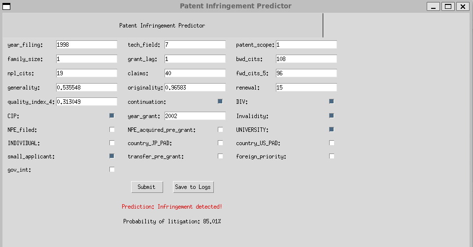

<p align="center">
  
</p>

<h1 align="center"> Modèle de Prédiction des Litiges sur les Brevets</h1>

<p align="center">
  Ce projet vise à construire un modèle de machine learning capable d’anticiper le risque de litige associé à un brevet au moment de son dépôt. Dans un contexte d’innovation technologique rapide et d’interdépendance croissante entre inventions, cette tâche s’avère cruciale, notamment pour les PME ne disposant pas de moyens juridiques avancés.
</p>

<p align="center">
  <a href="https://github.com/1drien/Projet-litige-des-brevets/stargazers">
    
  </a>
  <a href="https://github.com/1drien/Projet-litige-des-brevets/issues">
    
  </a>
  <a href="https://github.com/1drien/Projet-litige-des-brevets/blob/main/LICENSE">
    
  </a>
</p>

## Objectifs

- Développer un modèle prédictif robuste pour la détection précoce des litiges brevets.
- Comparer des approches linéaires et non linéaires.
- Améliorer la sensibilité du modèle à la classe minoritaire via des techniques de rééquilibrage.
- Proposer un outil interprétable pour les acteurs de la propriété intellectuelle.

---

## Données

Le jeu de données regroupe plusieurs milliers de brevets, caractérisés par :

- Informations temporelles : dates de dépôt, durée d’examen
- Données géographiques : pays d’origine, priorité étrangère
- Indicateurs de qualité : indices de diversité, de généralité, nombre de citations (avant/après)
- Contenu : nombre de revendications, statut universitaire, domaine technologique
- Cible : `Infringment` (binaire = 1 si litige, 0 sinon)

---

## Structure du Projet

```bash
PROJET_MI/
│
├── interface/
|   ├── logs.txt                     # sauvegarde des brevets litigieux
│   ├── ProgramInterface.py          # Lancement de l’interface utilisateur
│   ├── UI_Testing_Version.py        # Version alternative de test
│   └── model_fold_1.h5              # Modèle MLP entraîné
│
├── models/
│   ├── reg.py                       # Régression logistique
│   ├── ElasticNet.py                # Modèle Elastic Net
│   ├── baysar.py                    # Random Forest
│   ├── xgboost_model.py             # Modèle XGBoost
│   ├── NeuralNetwork_Modified.py    # Réseau de neurones (MLP)
│   ├── Dataset_Thuy (1).csv         # Données principales
|   └── Dataset.csv                  # Dataset pour le réseau de neurones
│
├── README.md
└── .gitignore
```

---

## Exécution des modèles

Assurez-vous d’avoir installé les dépendances nécessaires (voir plus bas ⬇️).

Chaque script peut être exécuté indépendamment pour entraîner et tester un modèle :

| Modèle                | Script à exécuter                  |
| --------------------- | ---------------------------------- |
| Régression logistique | `models/reg.py`                    |
| Elastic Net           | `models/ElasticNet.py`             |
| XGBoost               | `models/xgboost_model.py`          |
| Réseau de neurones    | `models/NeuralNetwork_Modified.py` |
| Random Forest         | `models/baysar.py`                 |

### Exemple : exécuter le modèle XGBoost

```bash
python models/xgboost_model.py
```

Les résultats s’affichent directement dans la console (matrice de confusion, F1-score, ratio TP/FP, etc.).

---

## Interface utilisateur

Une interface graphique permet de charger les caractéristiques d’un brevet et de prédire son risque de litige.

### Lancer l’interface :

```bash
python interface/ProgramInterface.py
```

Une fenêtre s’ouvrira pour permettre à l’utilisateur de saisir les informations d’un brevet ou de charger un fichier d’entrée.

> L’interface utilise le Réseau de neurones, qui est sauvegardé sous `interface/model_fold_1.h5`.

---

## Données

Le fichier de données se trouve ici :  
`models/Dataset_Thuy (1).csv`

---

## Dépendances et installation

Créez un environnement virtuel Python (optionnel mais recommandé) :

```bash
python -m venv venv
source venv/bin/activate   # Sous Windows : venv\Scripts\activate
```

Installez les dépendances avec :

```bash
pip install -r requirements.txt
```

### Contenu du fichier `requirements.txt` :

```txt
scikit-learn>=1.2.2
imblearn>=0.0
xgboost>=1.7.6
tensorflow>=2.11.0
numpy>=1.23.5
pandas>=1.5.3
matplotlib>=3.7.1
tk
joblib>=1.2.0

```

## Aperçu de l'interface

Voici un exemple de l'interface graphique permettant de prédire le risque de litige d'un brevet :

<p align="center">
  
</p>
